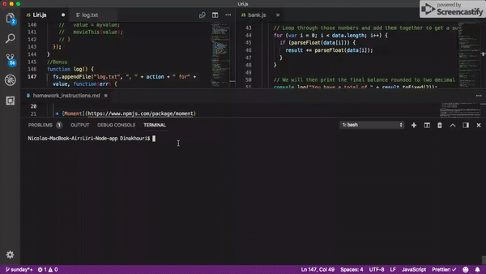
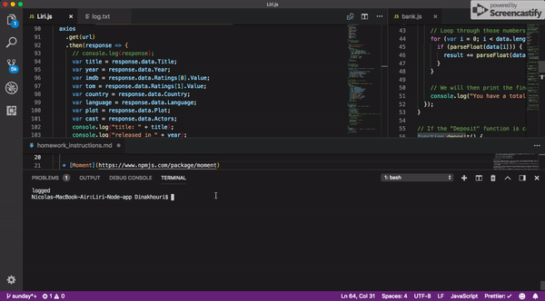
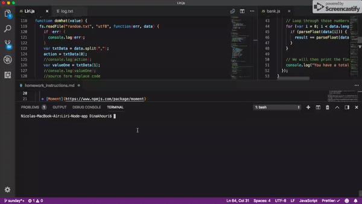

# Liri Node app

## Overview

LIRI is a _Language_ Interpretation and Recognition Interface. LIRI will be a command line node app that takes in parameters and gives you back data.

## Link

As this is a CLI App, it cannot be deployed to GitHub pages.However to be able to use this app you will have to download it to your computer, add your APIs and run it in the terminal.

## Quick View

#### `node Liri.js concert-this <artist/band name here>`

- This will search the Bands in Town Artist Events API for an artist and render the following information about each event to the terminal:

  - Name of the venue

  - Venue location

  - Date of the Event

  

#### `node Liri.js spotify-this-song '<song name here>'`

- This will show the following information about the song in terminal/bash window

  - Artist(s)

  - The song's name

  - A preview link of the song from Spotify

  - The album that the song is from

  

#### `node Liri.js movie-this '<movie name here>'`

- This will output the following information to your terminal/bash window:

    * Title of the movie.
    * Year the movie came out.
    * IMDB Rating of the movie.
    * Rotten Tomatoes Rating of the movie.
    * Country where the movie was produced.
    * Language of the movie.
    * Plot of the movie.
    * Actors in the movie.

#### `node Liri.js do-what-it-says`

- Using the `fs` Node package, LIRI will take the text inside of random.txt and then use it to call one of LIRI's commands.
  
